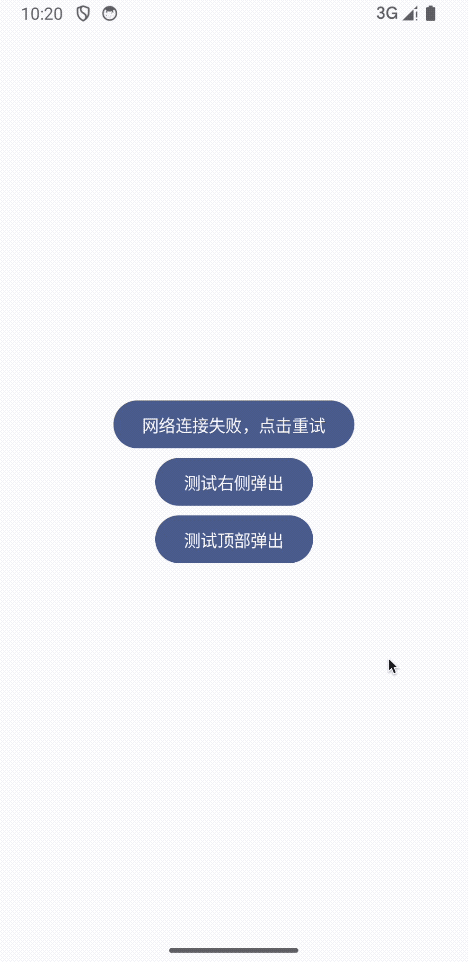

AnyPopDialog-Compose
===============
<a href="https://xiaozhuanlan.com/u/halifax"></a>
<a href="https://juejin.cn/user/8451824316670/posts"></a>
<a href="https://www.zhihu.com/people/fq_halifax"></a>
<a href="https://blog.csdn.net/logicsboy">

可控制Compose Dialog弹出的方向，支持上下左右，自由定制，真Dialog哦🔥

# 效果



# 集成

```gradle.kts
dependencies {
    implementation("io.github.TheMelody:any_pop_dialog_compose:1.0.1")
}
```

# 用法
```kotlin
@Composable
fun TestXXXX() {
    var showDialog by remember { mutableStateOf(false) }
    if (showDialog) {
        var isActiveClose by remember { mutableStateOf(false) }
        AnyPopDialog(
            modifier = Modifier.fillMaxWidth().background(...),
            isActiveClose = isActiveClose,
            // 根据你自己的功能，调整进入方向即可，支持:TOP/LEFT/RIGHT/BOTTOM
            // 也可以修改"状态栏"和"导航栏"背景色哦，自己查看方法注释即可
            properties = AnyPopDialogProperties(direction = DirectionState.BOTTOM),
            content = {
                // 这里放你自己的Dialog内容
                // 如果你需要在你自己的组件中想动画关闭Dialog，请更新isActiveClose
            },
            onDismiss = { showDialog = false }
        )
    }
    ...
}
```
